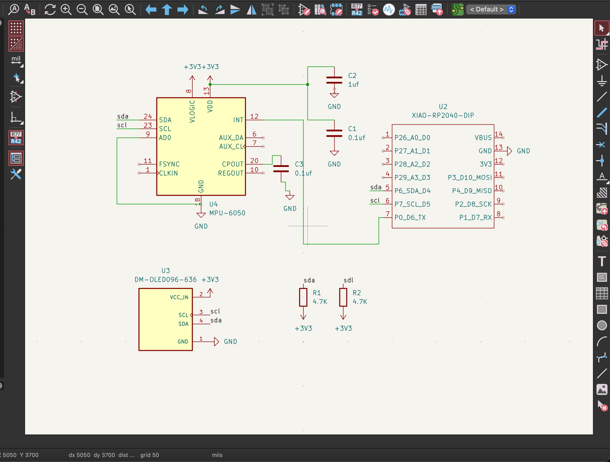
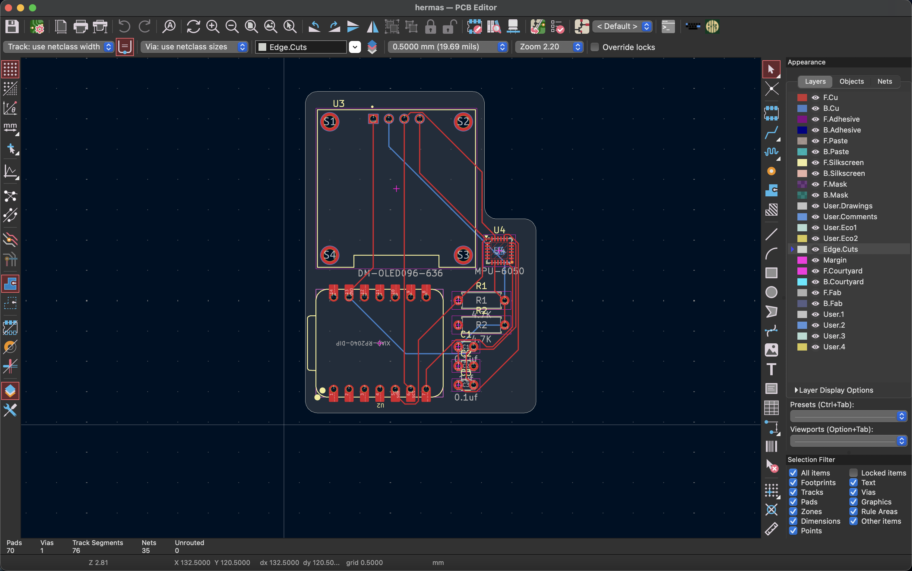
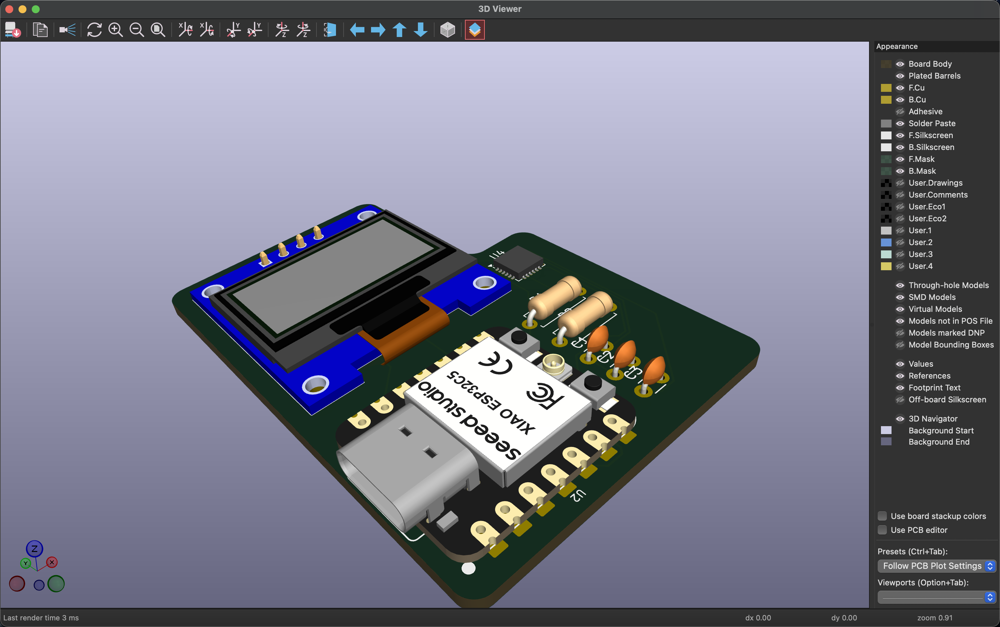

# Hermes Motion Meter

For my Hermes project, I made a compact handheld motion detector based on the MPU6050 IMU, a XIAO RP2040 microcontroller, and a 0.96" OLED screen. The board reads acceleration and rotational values of the sensor and outputs it on the screen.

I decided to use the MPU6050 because I wanted to know more about IMUs and how to make a device which detects motion. Also, since the MPU6050 communicates using I²C protocol, it helped me understand such concepts as pull-up resistors, datasheets, decoupling capacitors, and PCB designing.

## Schematic

The circuit board is controlled by the XIAO RP2040. Both the MPU6050 and the OLED display are connected through the I²C bus, meaning that they use common SDA and SCL pins.

### Connections

* XIAO RP2040
* MPU6050 IMU
* 0.96" I²C OLED Display

The MPU6050 is connected as follows:

* VDD → 3.3V
* VLOGIC → 3.3V
* GND → GND
* SDA → SDA
* SCL → SCL
* AD0 → GND
* INT → GPIO D6

The OLED screen is connected to the same I²C bus:

* VCC → 3.3V
* GND → GND
* SDA → SDA
* SCL → SCL

Two 4.7kΩ pull-up resistors were used for the SDA and SCL pins in order to follow the I²C specification.

Also, the MPU6050 employs decoupling capacitors in order to stabilize the voltage and minimize noise.

## PCB Design

The board was created in KiCad.

As MPU6050 is a tiny QFN device, I spent much time making sure that everything in the datasheet and footprint was checked properly. Routing the board was quite easy due to the fact that most of the connections were only four pins:

* SDA
* SCL
* 3V3
* GND

OLED and XIAO RP2040 are connected via headers, whereas MPU6050 and passives were soldered to the PCB.

Additionally, I have added silkscreen labels in order to simplify the assembly process.

# Bill of Materials (BOM)

| Part                             | Function                                                                    | Quantity | Supplier     |
| -------------------------------- | --------------------------------------------------------------------------- | -------- | ------------ |
| Seeed XIAO RP2040                | Main microcontroller for processing sensor data and controlling the display | 1        | Seeed Studio |
| MPU6050                          | 3-axis accelerometer and 3-axis gyroscope sensor for motion detection       | 1        | Robu.in      |
| 0.96" OLED Display (SSD1306 I²C) | Displays real-time acceleration and rotation data                           | 1        | Robu.in      |
| 4.7kΩ Resistor                   | I²C SDA pull-up resistor                                                    | 1        | Generic      |
| 4.7kΩ Resistor                   | I²C SCL pull-up resistor                                                    | 1        | Generic      |
| 0.1µF Capacitor                  | Decoupling capacitor for MPU6050 power stabilization                        | 2        | Generic      |
| 1µF Capacitor                    | Power filtering capacitor                                                   | 1        | Generic      |
| Custom PCB                       | Main circuit board for all components                                       | 1        | LionCircuits |

## Purchase Links

| Component                        | Purchase Link                                                                                                                                                       |
| -------------------------------- | ------------------------------------------------------------------------------------------------------------------------------------------------------------------- |
| Seeed XIAO RP2040                | [Seeed Studio Product Page](https://www.seeedstudio.com/XIAO-RP2040-v1-0-p-5026.html?utm_source=chatgpt.com)                                                        |
| Seeed XIAO RP2040 (India)        | [Robu.in Product Page](https://robu.in/product/seeed-studio-xiao-rp2040-v1-0/?utm_source=chatgpt.com)                                                               |
| MPU6050 Sensor Module            | [Robu.in MPU6050 Module](https://robu.in/product/mpu-6050-gyro-sensor-2-accelerometer/?utm_source=chatgpt.com)                                                      |
| MPU6050 IC                       | [Robu.in MPU6050 IC](https://robu.in/product/mpu-6050-qfn-24-3-axis-gyro-accelerometer-ic/?utm_source=chatgpt.com)                                                  |
| 0.96" OLED Display (SSD1306 I²C) | [Robu.in OLED Display (Blue)](https://robu.in/product/0-96-inch-i2c-iic-oled-lcd-module-4pin-with-vcc-gnd-blue/?utm_source=chatgpt.com)                             |
| 0.96" OLED Display (SSD1306 I²C) | [Robu.in OLED Display (White)](https://robu.in/product/0-96-inch-i2c-iic-oled-lcd-module-4pin-with-vcc-gnd-white/?utm_source=chatgpt.com)                           |
| 0.96" OLED Display (SSD1306 I²C) | [Robu.in OLED Display (128×64 SSD1306)](https://robu.in/product/0-96-inch-128x64-ssd1306-iic-interface-4-pin-oled-module-blue-color-screen/?utm_source=chatgpt.com) |
| 4.7kΩ Resistor                   | [Robu.in Resistors Collection](https://robu.in/product-category/passive-components/resistors/?utm_source=chatgpt.com)                                               |
| 0.1µF Ceramic Capacitor          | [Robu.in Capacitors Collection](https://robu.in/product-category/passive-components/capacitors/?utm_source=chatgpt.com)                                             |
| 1µF Capacitor                    | [Robu.in Capacitors Collection](https://robu.in/product-category/passive-components/capacitors/?utm_source=chatgpt.com)                                             |
| PCB Manufacturing                | [LionCircuits](https://lioncircuits.com/?utm_source=chatgpt.com)                                                                                                    |

## Component Summary

The Hermes Motion Meter is built around the Seeed XIAO RP2040 microcontroller. Motion sensing is provided by the MPU6050 IMU, which combines a 3-axis accelerometer and a 3-axis gyroscope. A 0.96-inch SSD1306 OLED display connected through the I²C bus is used to display sensor readings in real time.

The I²C communication lines (SDA and SCL) use 4.7kΩ pull-up resistors. Two 0.1µF decoupling capacitors and one 1µF filtering capacitor are included to ensure stable operation of the MPU6050 and reduce power supply noise. All components are mounted on a custom-designed PCB manufactured through LionCircuits.

## Assembly

Upon receiving the PCB and components, I proceeded to assemble the circuit.

The MPU6050 module was the hardest part due to its tiny size; I applied flux and soldered each pin making sure there were no solder bridges. After the MPU6050 module had been soldered, all other components were much easier to solder.

Then I soldered passive components, and after that the OLED header and the XIAO RP2040 headers.

After assembling the board, I flashed the firmware and tested whether the sensor was working using I²C.

## Firmware

Firmware is used to initialize MPU6050 and OLED via the I²C bus.

Display shows:

* X axis, Y axis, and Z axis acceleration 
* X axis, Y axis, and Z axis rotation rate
* Real-time motion of the device

XIAO RP2040 is always reading data from MPU6050 and updating OLED display.

## What I Learned

From this project, I learned about:

* Datasheets reading
* Schematics designing
* PCB routing
* I²C protocol
* Pull-up resistors
* Decoupling capacitors
* Surface mount soldering
* Motion sensors usage

Overall, Hermes was an enjoyable project that provided a lot of valuable experience in developing a custom-made sensor board.
